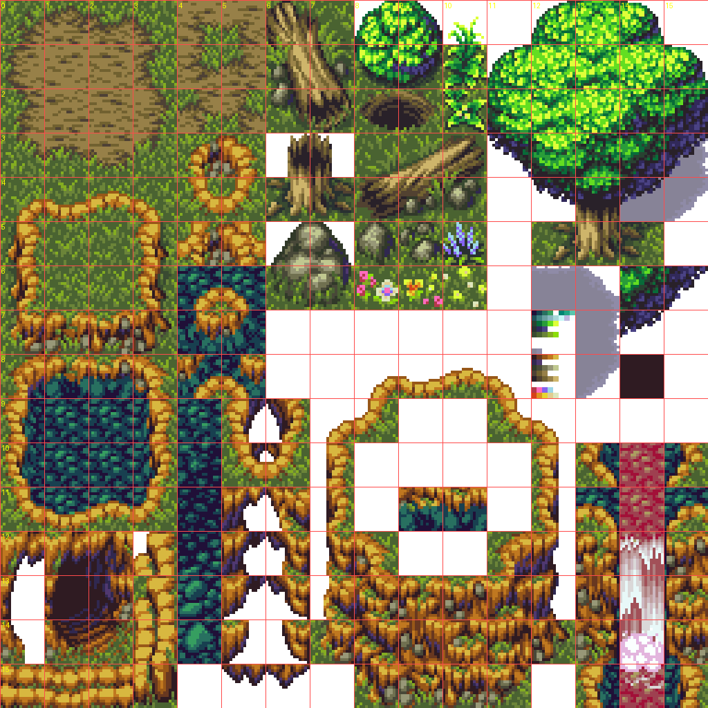

# Guide 12c — Hand-painting the ground

**Goal:** paint the ground tile-by-tile with the Tile Palette (grass, dirt,
flowers — whatever mix you want) and have it actually stick: no more losing
your work every time you press Play. Inserted between `12a` (ground tileset
import) and `12b` (castle walls, still not started) since it builds directly
on `12a`'s art and doesn't depend on walls at all.

This guide assumes you've read `saving-and-committing.md` already — follow
that checklist at the end as always.

---

## Why your painting was disappearing

`CastleMapGenerator.Start()` used to unconditionally regenerate the **entire**
map — ground included — every single time you pressed Play, by clearing the
ground Tilemap and refilling it with one repeated tile. Walls and gates are
*meant* to work that way (they're described by data — the Wall/Gate Region
lists — specifically so future levels can reuse the same code with different
regions). Ground never had that kind of data behind it, so "regenerate on
every Play" just meant "erase whatever you hand-painted."

Fixed on this branch: `Start()` now only regenerates walls/gates.
Ground is never touched automatically, so whatever you paint in the Editor
and save now survives Play Mode, restarting Unity, everything. Each level's
ground is dedicated, hand-authored art — no auto-fill trying to keep it
"consistent" behind your back, which is exactly what makes it *stay*
consistent level to level: it only changes when you change it.

One button still exists that **will** wipe the ground on purpose:
right-click the `CastleMapGenerator` header → **Fill Ground (Reset)**. Use it
once to get a blank solid-grass canvas before you start painting a new level
— don't reach for it out of habit afterward the way the old combined
"Generate Map" used to get re-run.

---

## Step 1 — Pull and verify

1. **Fetch → Pull** in GitHub Desktop (or `git pull`) before opening Unity.
2. Open the project, let it recompile, check the **Console** for zero red
   errors. You should see a new `Tools > Castle Breach > Create Ground Tile
   Variants` menu item — that confirms `CreateGroundTileVariants.cs` compiled.
3. Press Play once, then Stop. The map should look exactly the same as
   before you pressed Play — walls/gates in place, ground unchanged. That's
   the fix working: previously this would have silently reset ground to a
   flat single tile.

---

## Step 2 — Create a few ground tile variants

`12a` already sliced the whole `GentleForestV01.png` sheet into individual
sprites — we just haven't turned any of them into paintable Tile assets
besides the plain grass one (`GroundTile.asset`). A handful of good, **plain
(non-blended-edge)** picks off the sheet, using the same column/row reference
image from `12a`:

| What | Column, Row | Notes |
|---|---|---|
| Plain dirt | **2, 1** | Dead center of the dirt block (cols 0–4, rows 0–2) — picking a cell on that block's edge instead would bake in a grass-blend fringe you don't want yet, since that's autotile art, not plain fill. |
| Pink flowers on grass | **5, 6** | Sits right next to the grass tile already in use (col 1, row 6). |
| Yellow/orange flowers on grass | **6, 6** | Same row, one cell over. |

Feel free to pick others instead/as well (small rock clusters around col 5,
row 5 are decorative and plain too) — the table above is just a simple
starting set, per the "keep it simple for now" call.

1. In the Project window, open `Assets/Sprites/Environment` and expand
   `GentleForestV01` (the arrow next to it) to see all its sliced
   sub-sprites.
2. Convert (column, row) into a pixel position the way `12a` did:
   `x = column × 16, y = row × 16` — hover sub-sprites in the Project window
   (or check the Sprite Editor) until the thumbnail matches what you expect
   from the reference image above. Rename isn't required to identify them.
3. **Tools → Castle Breach → Create Ground Tile Variants.**
4. Drag your chosen sprites into the window's **Sprites** list (use the `+`
   to add slots), then click **Create Tile Assets**.
5. Check the Console: `Created 3 tile asset(s) in Assets/Tiles`. In
   `Assets/Tiles` you'll see new `.asset` files named after whatever Unity
   auto-named the sub-sprites — select each and **F2**-rename to something
   readable, e.g. `GroundTile_Dirt`, `GroundTile_FlowerPink`,
   `GroundTile_FlowerYellow`.

---

## Step 3 — Paint

1. **Window → 2D → Tile Palette.** Palette dropdown (top-left) → **Create New
   Palette** (or reuse one if you already made one) — name it e.g.
   `GroundPalette`, keep default Grid/Tilemap settings, save it into
   `Assets/Tiles` or wherever you like.
2. Drag `GroundTile.asset` (plain grass) and your new variants from
   `Assets/Tiles` into the Tile Palette's checkered grid area.
3. In the Hierarchy, select the **`Ground`** Tilemap (the actual paint
   target — make sure it's selected, not `Walls` or `Gates`, or you'll paint
   onto the wrong layer).
4. Back in the Tile Palette window, pick a tile from the palette, then use
   the **Brush** tool (top toolbar of the Tile Palette) to click/drag onto
   the map in the Scene view. **Erase** tool removes a tile back to nothing;
   painting `GroundTile` over something is how you overwrite one variant
   with another.
5. Paint a mix — replace some solid grass with dirt patches and flower
   clusters wherever you want them. There's no wrong way to do this; it's
   your level's ground.
6. Press Play to confirm your painting survives. Stop, and it should still
   be exactly as you left it (this is the whole point of `12c`).

---

## Fixing it if you painted on the wrong layer

Easy mistake: the Tile Palette paints onto whatever Tilemap is selected in
the Hierarchy, and if `Walls` or `Gates` was selected instead of `Ground`
when you painted, those tiles will vanish on Play — `Walls`/`Gates` still
fully regenerate from their region lists every time (unchanged, intentional
— see "Why your painting was disappearing" above). You'll notice this
because tiles you just painted disappear the moment you press Play, while
tiles painted on the real `Ground` layer don't.

No need to re-paint by hand — a new **Tools → Castle Breach → Move Tiles
Between Layers** tool fixes it:

1. **Tools → Castle Breach → Move Tiles Between Layers.**
2. **Source Tilemap** ← whichever layer you painted onto by mistake (e.g.
   `Walls`). **Target Tilemap** ← `Ground`.
3. **Tile To Preserve** ← the real tile for that layer (`WallTile.asset` for
   `Walls`, `GateTile.asset` for `Gates`). This is the important part: it's
   what tells the tool "leave the actual border walls/gates alone, only
   move the other stuff." Without it, the tool would move every tile
   including your real walls.
4. Click **Move Tiles**. Check the Console for `moved N tile(s)`.
5. Press Play once (or right-click `CastleMapGenerator` → **Generate Walls
   && Gates**) — this rebuilds `Walls`/`Gates` cleanly from the region data,
   restoring any real wall/gate tile that got overwritten by the mistake in
   the first place. `Ground` (now holding your moved tiles) is untouched by
   this, same as always.
6. Confirm in the Scene view: your painted variety is now on the ground,
   the border walls/gates look correct, and Play no longer wipes anything.

---

## Step 4 — Save and commit

Follow `saving-and-committing.md`: File → Save, File → Save Project, check
GitHub Desktop's Changes tab (expect the `Game` scene, the new
`CreateGroundTileVariants.cs`/`MoveTilesBetweenLayers.cs` + their `.meta`
files, and your new Tile `.asset` + `.meta` files), commit, push.

---

## ✅ Checkpoint

- [ ] Pulled latest, `Tools > Castle Breach > Create Ground Tile Variants`
      menu item exists, zero Console errors
- [ ] Played once and confirmed the map (ground included) looked identical
      before and after — no more auto-reset
- [ ] Created at least a couple of ground tile variants (dirt, flowers, or
      your own picks), renamed them readably
- [ ] Hand-painted a mix onto the `Ground` Tilemap and confirmed it survives
      Play Mode
- [ ] Committed and pushed

## Notes for later

- **This is Editor-time hand-painting, not the runtime Map Builder tool** —
  those are different things. The full designer-facing builder (start/stop
  test rounds, unlimited gold, spawn-rate controls, in-game tile editing) is
  still `ROADMAP.md` Phase 7 (§3.5/§10.5), deliberately last since it
  consumes everything built before it. This guide is a much lighter
  stepping stone that lets you start shaping levels well before Phase 7
  exists, using Unity's own Tile Palette instead of a custom in-game tool.
- **RuleTile/autotiling still isn't set up** — same call as `12a`: plain
  tiles first, blended grass/dirt/cobblestone edges later, likely alongside
  `12b`.
- **Tile *properties* (walkable/blocking/breakable, water ranged-units-can-
  shoot-over, unbreakable rocks, etc.) aren't built yet either.** Right now
  every ground tile is purely cosmetic — none of it affects movement or
  combat, that's still only `Walls`/`Gates` via `CastleMapGenerator.IsWall`/
  `IsGate`. See the README's "Deferred" section for the fuller tile-type
  vision this is heading toward, and `ROADMAP.md` Phase 7's obstacle-regions
  note for where "rocks" specifically was already planned.
